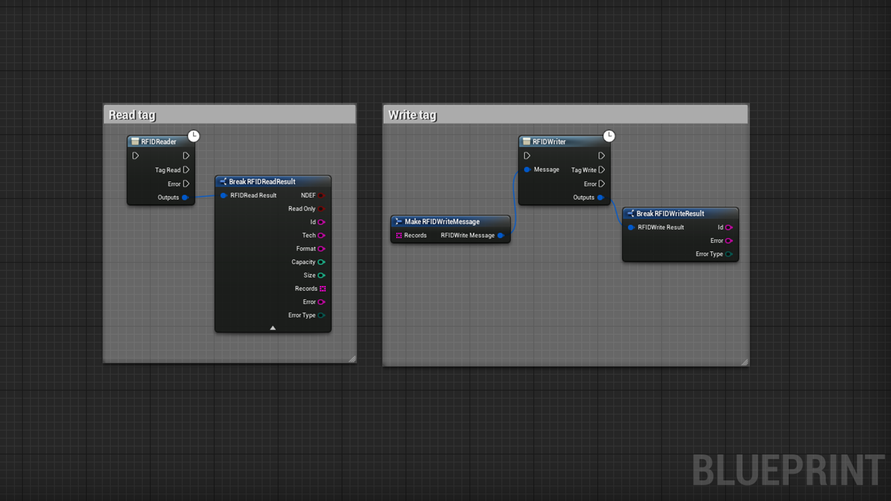
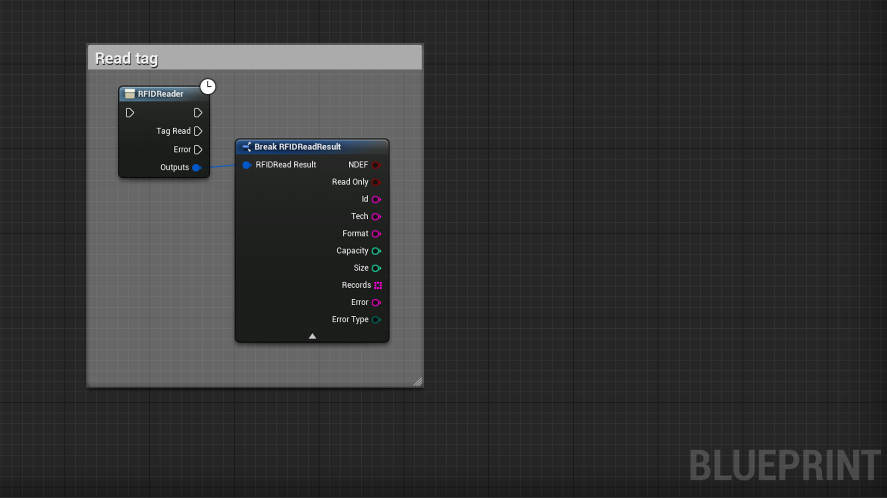
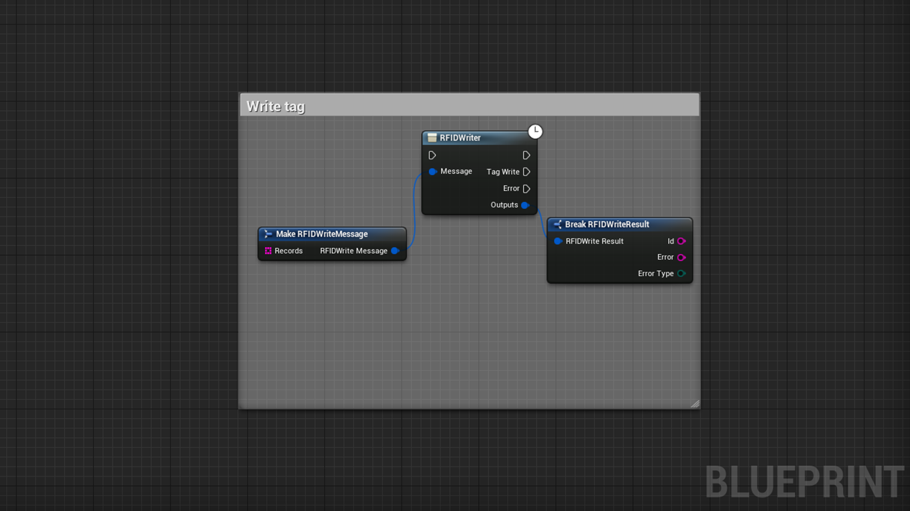

# RFIDHelper

- UE4 Plugin to handle RFID NFC tag operations
- It exposes async nodes to read and write on a compatible NDEF tag (NFC Data exchange format)
- Works only for android phones with NFC and with Android API level 19+
- Can be used in any blueprint

 

[Link to the plugin in the marketplace](https://www.unrealengine.com/marketplace/en-US/product/f5bacbc14f7f42c2b0f1c8032315d4fd)

# Documentation

 

# Read

    Note: A small freeze may occur during reading, I'm still searching to find why

| Node | Inputs | Outputs | Note |
| ---- | ------ | ------- | ---- |
| RFIDReader | void | TagRead(FRFIDReadResult), Error(FRFIDReadResult) | Async node to read tag detected by the android phone |

# Write

    Note: A small freeze may occur during writing, I'm still searching to find why

| Node | Inputs | Outputs | Note |
| ---- | ------ | ------- | ---- |
| RFIDWriter | Message(FRFIDWriteMessage) |  TagWrite(FRFIDWriteResult), Error(FRFIDWriteResult) | Async node to write the first tag detected by the android phone with the provided message |