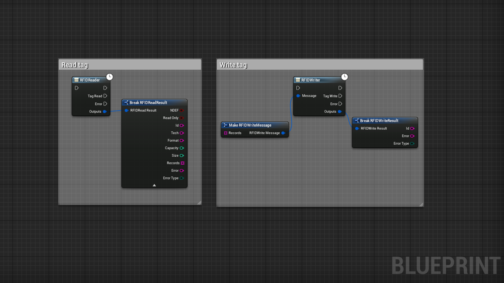
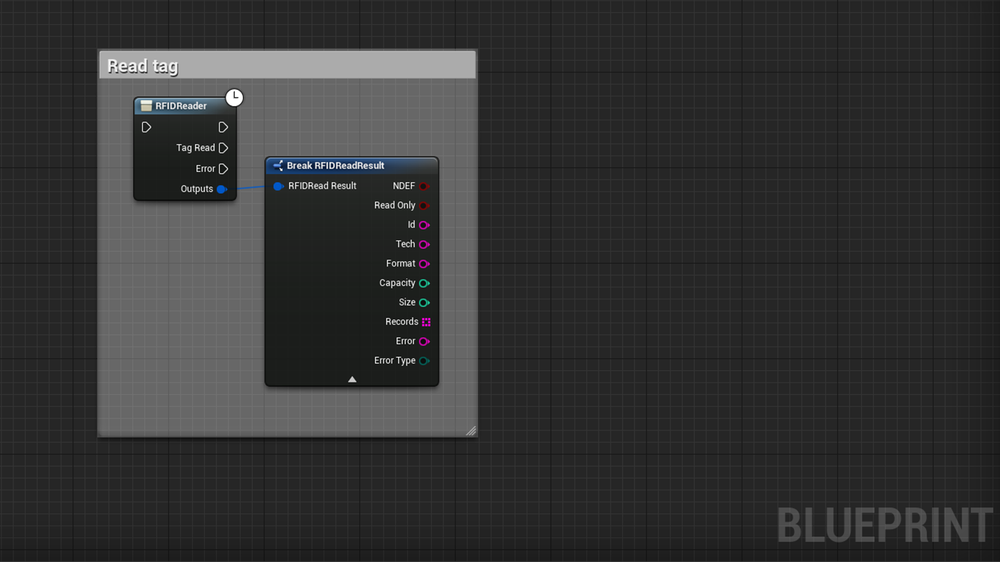
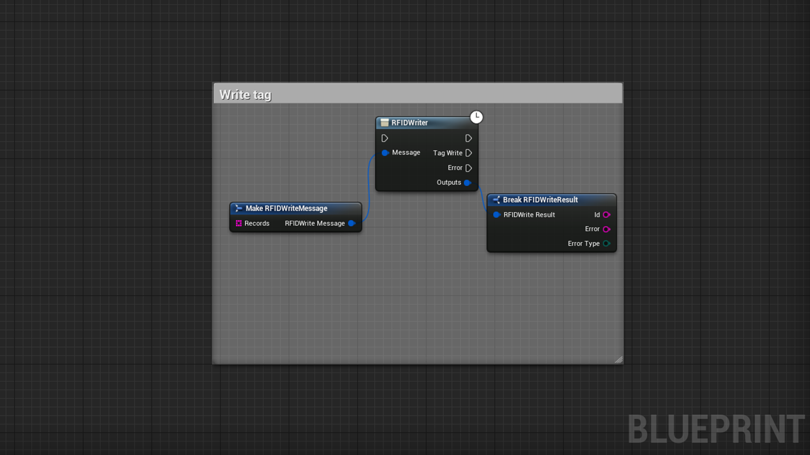
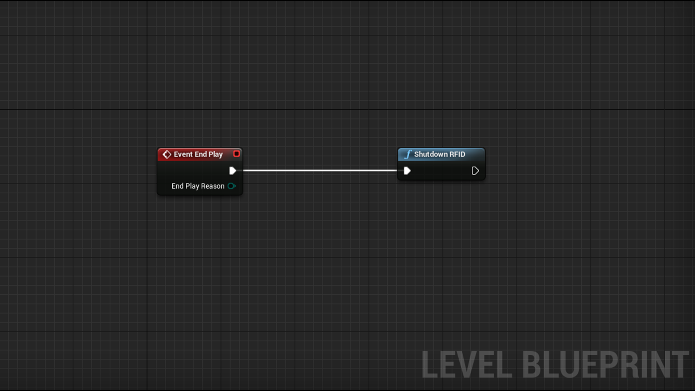

# RFIDHelper

 

# About

- UE plugin to handle RFID tag operations through NFC (works only for Android phones with NFC and with Android API level 19+)
- It exposes easy to use async blueprint functions to continuously scan, read and write on a compatible NDEF tag (NFC Data exchange format)
- Blueprint/C++ code communicates directly with a custom built android library (java) specifically made for this plugin to avoid any thirdparty code

# Setup

1. [Get the plugin on the marketplace](https://www.unrealengine.com/marketplace/en-US/product/rfid-helper) and install the plugin for the engine version you wish to use
2. Create or open an unreal engine project with a supported version
3. In the editor, go to Edit/Plugins, search for the plugin, check the box to enable it and restart the editor
4. When a new plugin version is available, go to your Epic Games Launcher, under Unreal Engine/Library, below the engine version, you will find your installed plugins, find the plugin and click on update, then wait for it to finish and restart your editor

 

# Support

### Bugs/Issues

If you encounter issues with this plugin, you **should** report it, to do so, in the editor, go to Edit/Plugins, search for this plugin, click on the plugin support button, this will open your browser and navigate to the plugin issue form where you need to fill in all the relevant details about your issue, this will help me investigate and reproduce it on my own in order to fix it. Be precise and give as many details as you can. Once solved, a new plugin version will be submitted to the marketplace, update the plugin and you are good to go. **Due to epic marketplace limitations, I can only patch/update this plugin for the last 3 engine version, older engine versions will not be supported anymore.**

### Feature requests

If you want a new feature relevant to this plugin use case, you can submit a request in the [plugin marketplace question page](https://www.unrealengine.com/marketplace/en-US/product/rfid-helper/questions). I **may** add this new feature in a future plugin version.

 

# Documentation

_Screenshots may differ from the latest plugin version, some features may have evolved or have been removed if deprecated._

**ERFIDError** is an enum used to enumerate all the error that can happen

### Read

**FRFIDReadResult** is a struct used to provide read result like IsNDEF, IsReadOnly, Id, Tech, Format, Capacity, Size, Records, Error, ErrorType

| Node | Inputs | Outputs | Note |
| ---- | ------ | ------- | ---- |
| RFIDReader | | | Async node to start a read content task when a tag is detected, will run continuously until ShutdownRFID is called |
| OnTagRead | | Outputs(FRFIDReadResult) | Event triggered when the tag content has been read |
| OnError | | Outputs(FRFIDReadResult) | Event triggered when an error occurs, you can check the "Error" and "ErrorType" properties to have more details about it |

### Write

**FRFIDWriteMessage** is a struct used to provide message content like Records, FormatNDEF, MakeReadOnly. The tag can be format to be NDEF (NFC Data exchange format) compatible. The tag can be set to read only to prevent overwriting its content, this cannot be undone.

**FRFIDWriteResult** is a struct used to provide write result like Id, Error, ErrorType. Specify the result of the write operation and the tag Id on which it was carried on.

| Node | Inputs | Outputs | Note |
| ---- | ------ | ------- | ---- |
| RFIDWriter | Message(FRFIDWriteMessage) | | Async node to start a write content task on the first tag detected (overwrites all records stored on the tag with the new records), will run once and then disable itself once a tag has been written or a fatal error has been triggered, you can restart it by calling it again |
| OnTagWrite | | Outputs(FRFIDWriteResult) | Event triggered when the content has been written on a tag |
| OnError | | Outputs(FRFIDWriteResult) | Event triggered when an error occurs, you can check the "Error" and "ErrorType" properties to have more details about it |

### Utility

| Node | Inputs | Outputs | Note |
| ---- | ------ | ------- | ---- |
| ShutdownRFID | | | Stops the continuous detection of tags for read or pending write operations, this will free the memory, you can call the Write/Read nodes again if you want to restart the process |